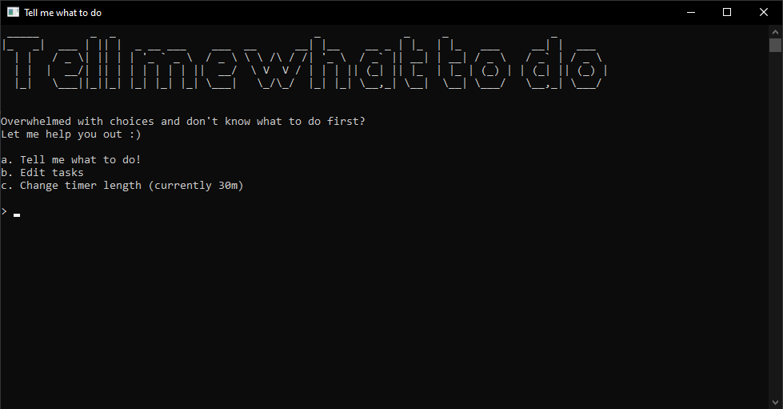
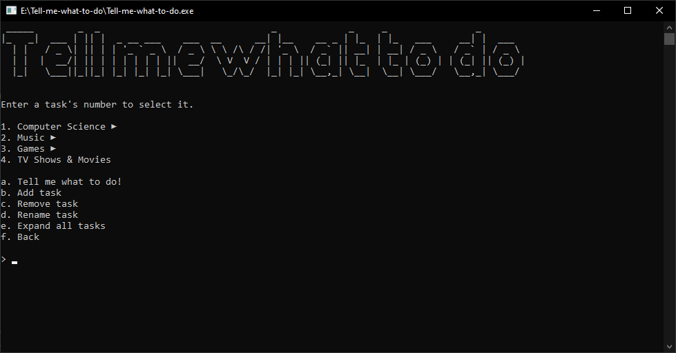
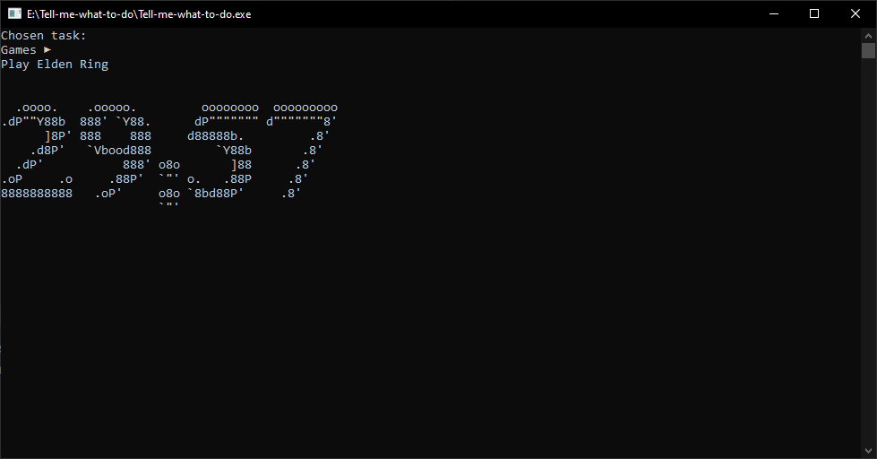

# Tell me what to do
A simple console application that tells you what to do when you're too indecisive.  
  
Tasks are structured like folders and files, where you can add subtasks inside another task.
When choosing a task, the program will only choose tasks that do not contain any subtasks (i.e. leaf tasks)

## Start menu
Here you can choose to edit your tasks or change the timer length.

## Edit tasks
Here you can add, remove and rename your tasks.

## After a task is chosen
A timer will tick down, which can be cancelled by pressing Ctrl+C.

